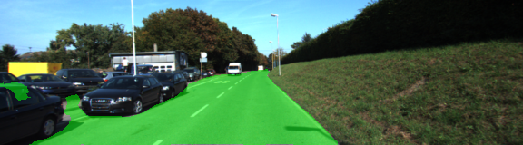
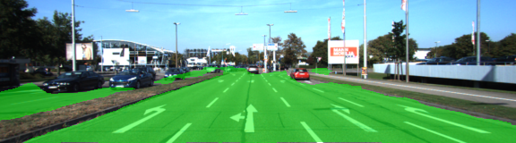
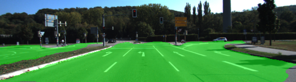

# Semantic Segmentation
### Introduction
In this project, you'll label the pixels of a road in images using a Fully Convolutional Network (FCN).

### Setup
##### GPU
`main.py` will check to make sure you are using GPU - if you don't have a GPU on your system, you can use AWS or another cloud computing platform.
##### Frameworks and Packages
Make sure you have the following is installed:
 - [Python 3](https://www.python.org/)
 - [TensorFlow](https://www.tensorflow.org/)
 - [NumPy](http://www.numpy.org/)
 - [SciPy](https://www.scipy.org/)

You may also need [Python Image Library (PIL)](https://pillow.readthedocs.io/) for SciPy's `imresize` function.

##### Dataset
Download the [Kitti Road dataset](http://www.cvlibs.net/datasets/kitti/eval_road.php) from [here](http://www.cvlibs.net/download.php?file=data_road.zip).  Extract the dataset in the `data` folder.  This will create the folder `data_road` with all the training a test images.

### Start
##### Implement
Implement the code in the `main.py` module indicated by the "TODO" comments.
The comments indicated with "OPTIONAL" tag are not required to complete.
##### Run
Run the following command to run the project:
```
python main.py
```
**Note:** If running this in Jupyter Notebook system messages, such as those regarding test status, may appear in the terminal rather than the notebook.

### Why Layer 3, 4 and 7?
In `main.py`, you'll notice that layers 3, 4 and 7 of VGG16 are utilized in creating skip layers for a fully convolutional network. The reasons for this are contained in the paper [Fully Convolutional Networks for Semantic Segmentation](https://arxiv.org/pdf/1605.06211.pdf).

In section 4.3, and further under header "Skip Architectures for Segmentation" and Figure 3, they note these provided for 8x, 16x and 32x upsampling, respectively. Using each of these in their FCN-8s was the most effective architecture they found. 

### Results

Good Results          |  Poor Result
:-------------------------:|:-------------------------:
  |  
  |  
  |

#### Network Architecture
Per the class recommendation found [here](https://s3-us-west-1.amazonaws.com/udacity-selfdrivingcar/forum_archive/Semantic_Segmentation_advice.pdf) I scaled the incoming pooling layers from the VGG used in the skip levels which improved the inference of the network.

#### Hyperparameters
I trained my network with the following hyperparameters:

Batch Size = 5
Dropout = 0.5
Epochs = 60
Learn Rate = 0.0009

I played around with several different learn rates (0.0001, 0.0005, 0.001) before finally settling on 0.0009. I found after comapring my results to other colleagues that we'd converged on a similar result.


